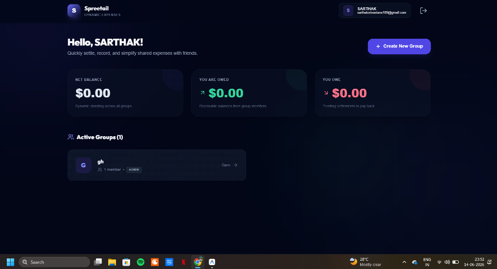
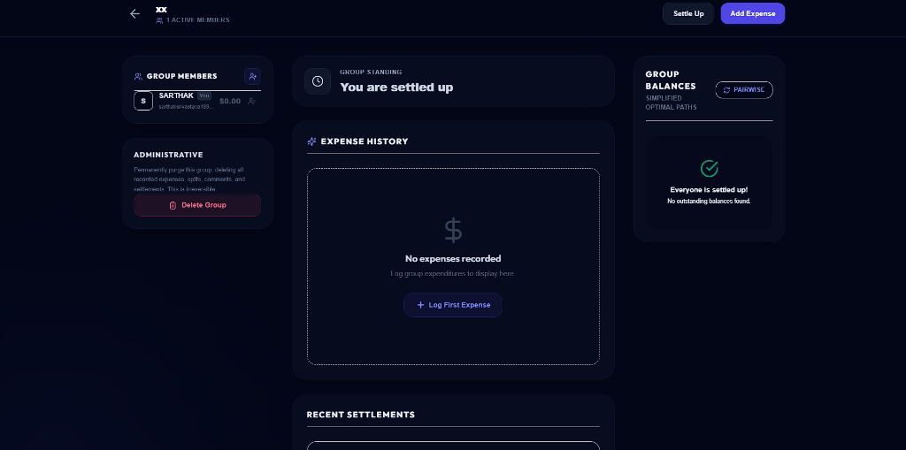
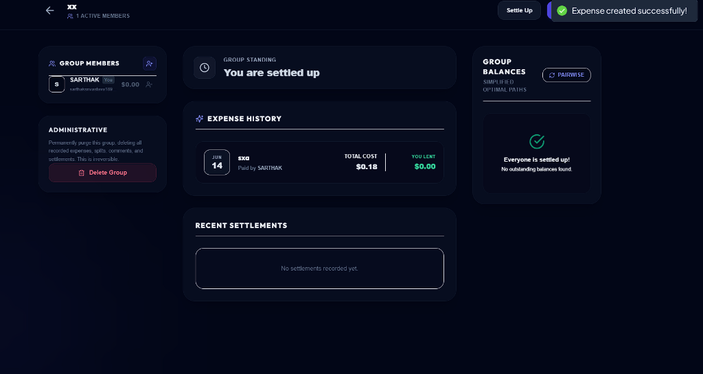
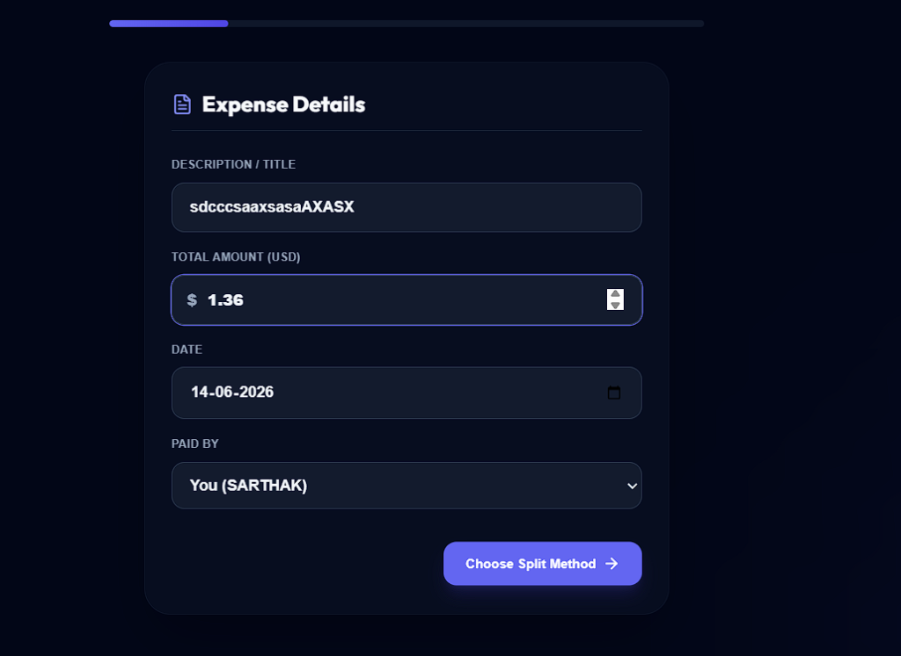
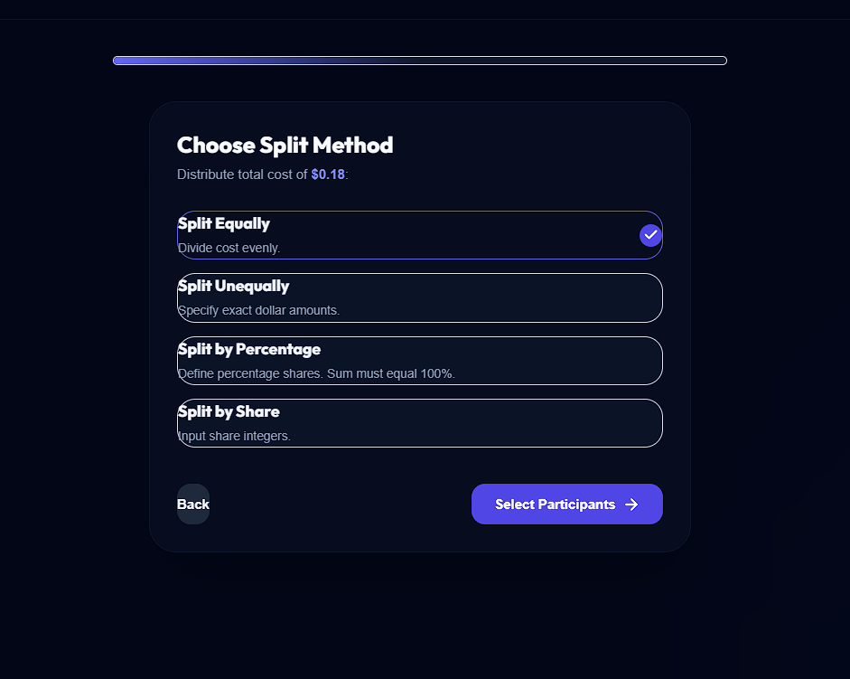
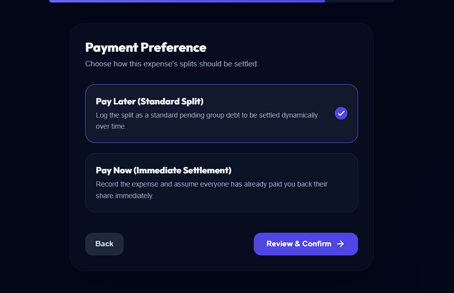
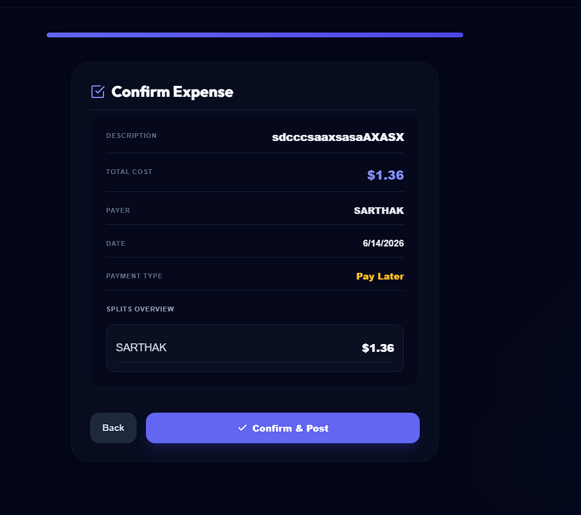

# 💸 Spreetail — Peer-to-Peer Expense Tracker & Debt Settlement Platform

A premium, production-grade peer-to-peer expense tracking and debt settlement application modeled after the core features of Splitwise. Built with a robust monorepo architecture, this application supports dynamic multi-mode splitting (Equal, Unequal, Percentages, Shares), intelligent **Greedy Debt Minimization**, real-time WebSocket comment threads, and instant/deferred payment settlements with multiple payment methods.

---

## 🎨 Visual Tour (UI & UX)

Explore the application's clean, modern dark mode interface designed with **Slate & Indigo aesthetics**, featuring responsive layouts and glassmorphic elements.

### 🏠 Dashboard & Group standing
*Track all active groups, net standing balances (what you owe and what you are owed), and access details instantly.*


---

### 👥 Group Details (Empty & Active State)
*View members, outstanding simplified balances, and recent settlements. It dynamically displays empty states and active expense cards.*
| Empty Group Detail | Group with Active Expenses |
| :---: | :---: |
|  |  |

---

### ⚡ Create Expense Wizard (5-Step Flow)
*A structured 5-step stepper to input details, select splitting rules, customize participants, configure payment preferences, and review details before posting.*

| Step 1: Expense Details | Step 2: Split Method |
| :---: | :---: |
|  |  |

| Step 4: Pay Now vs Pay Later | Step 5: Review & Confirm |
| :---: | :---: |
|  |  |

---

## 🚀 Core Architectural Features

### 1. Dynamic Splitting Methods
We support four distinct mathematical modes to divide bills:
- **Equal Split**: Evenly divides the total cost among participants, automatically adjusting any remainder cents to the payer's share (safeguarding against rounding errors).
- **Unequal Split**: Allows specifying exact dollar amounts per participant, enforcing that the sum equals the total cost.
- **Percentage Split**: Computes split shares based on user percentages. Enforces a strict total of 100%.
- **Share Split**: Divides cost based on customized ratio multipliers (shares).

### 2. Greedy Debt Minimization Algorithm ($O(N \log N)$)
Instead of members performing multiple bilateral payments, the platform computes optimized pairwise transactions. 
- Aggregates net pairwise balances.
- Separates users into a sorted queue of **Debtors** and **Creditors**.
- Recursively matches the maximum debtor with the maximum creditor, resolving outstanding balances in the minimum possible number of transactions.

### 3. Immediate vs Deferred Settlements ("Pay Now" vs "Pay Later")
During expense creation, users can specify their settlement preference:
- **Pay Later (Standard Split)**: Registers splits as pending group balances to be resolved at a later date.
- **Pay Now (Immediate Settlement)**: Records the expense and transactionally logs matching payments from all participants, balancing the ledger to `$0.00` immediately while preserving historical logs.
- Supported settlement channels: **Cash 💵, Bank Transfer 🏦, Venmo 📱, PayPal 💳, UPI ⚡, Credit Card 💳**.

### 4. Real-Time Chat & Socket.io Integration
- Bidirectional room-based communication on every individual expense page.
- Middleware verifies user membership status before granting access to expense chatrooms.
- Dynamic message logs and typing indicator broadcasts.

---

## 🛠️ Tech Stack & Monorepo Structure

| Layer | Technologies | Role / Feature |
| :--- | :--- | :--- |
| **Frontend** | React (Vite + TS) | Single-page application, Tailwind CSS styling, Zustand state management, React Query data fetching. |
| **Backend** | Node.js + Express | REST APIs, validation via Zod, Socket.io integration. |
| **Database** | PostgreSQL | Relational storage for users, groups, splits, settlements, and messages. |
| **ORM** | Prisma | Schema migrations, database seed scripts, and type-safe querying. |
| **Auth** | JWT | Access (15m in memory) + Refresh (7d in secure httpOnly cookies). |

```
Spreetail (Monorepo)
├── backend/                  # Express REST API & WebSockets server
│   ├── prisma/               # Prisma schema definitions & migrations
│   │   ├── schema.prisma     # Database schema configuration
│   │   └── seed.ts           # Development database seed script
│   └── src/                  # Backend application source code
└── frontend/                 # React Single Page Client
    ├── src/
    │   ├── components/       # Reusable UI elements (modals, chats, buttons)
    │   ├── pages/            # Core views (Dashboard, Group, Wizard)
    │   └── store/            # Zustand global client state
    └── tailwind.config.js    # Styling system variables
```

---

## ⚙️ Environment Variables Configuration

Set up the following variables before launching the services:

### Backend (`backend/.env`)
```env
PORT=3000
DATABASE_URL="postgresql://<user>:<password>@localhost:5433/spreetail?schema=public"
JWT_ACCESS_SECRET="generate-64-char-hex-string"
JWT_REFRESH_SECRET="generate-64-char-hex-string"
FRONTEND_URL="http://localhost:5173"
NODE_ENV="development"
BCRYPT_SALT_ROUNDS=12
```

### Frontend (`frontend/.env`)
```env
VITE_API_URL="http://localhost:3000"
VITE_SOCKET_URL="http://localhost:3000"
```

---

## ⚡ Local Setup & Execution

### 1. Database Setup
Ensure you have a PostgreSQL server running (defaulting to port `5433` or configure your `DATABASE_URL` appropriately).

### 2. Backend Installation & Seed
```bash
# Navigate to the backend directory
cd backend

# Install dependencies
npm install

# Apply database schema migrations
npx prisma migrate dev

# Seed database with sample groups and users
npm run db:seed

# Start backend dev server
npm run dev
```

### 3. Frontend Installation & Execution
```bash
# Navigate to the frontend directory (in a new terminal)
cd ../frontend

# Install dependencies
npm install

# Start local Vite development server
npm run dev
```

Open [http://localhost:5173](http://localhost:5173) in your browser. Log in with the seeded credentials:
- **Email**: `sarthak@example.com`
- **Password**: `password123`

---

## 🔒 Security & Performance Features

- **Refresh Token Rotation**: Refresh tokens are rotated on every new token exchange, preventing session hijacking. Invalid/replayed refresh requests revoke all active sessions.
- **Formless Layouts**: Adhering to modern React architectures, forms are controlled dynamically via Zustand state fields and event handles instead of native `<form>` submits, preventing page refresh/state loss.
- **Floating-Point Cent Safety**: Balances are calculated by casting strings using `Number(val).toFixed(2)` and storing split amounts in high-precision database `Decimal(10, 2)` types, preventing standard floating-point representation bugs.
- **Relational Integrity**: Deleting a group cascades down to clean up all related expenses, participant shares, messages, and settlements.
